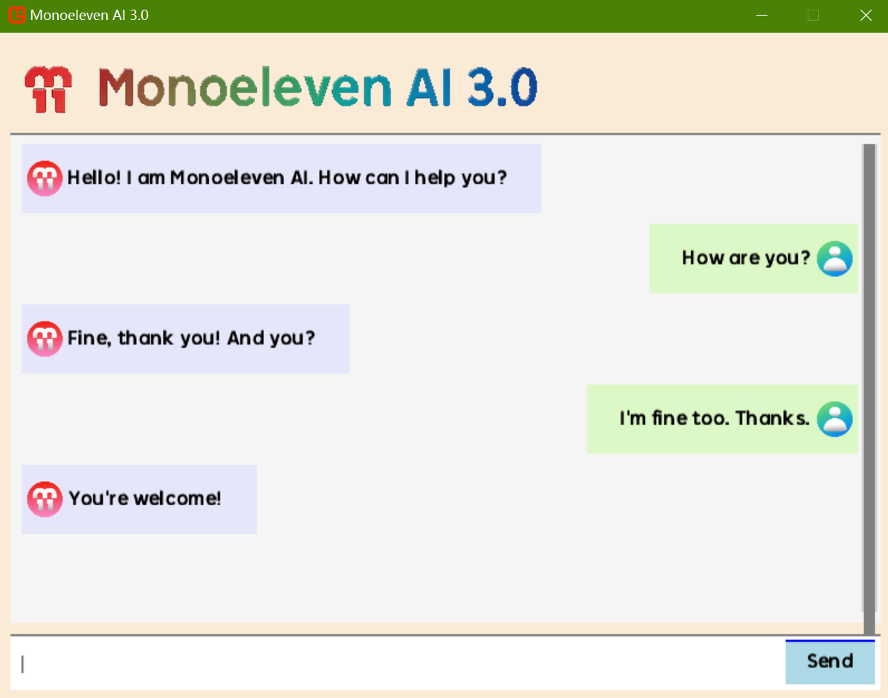

# Monoeleven.ChatbotTemplate



A comprehensive MonoGame-based chatbot template package providing a minimal viable product (MVP) for building interactive chatbot applications. This template supports both C# and VB.NET implementations with native English language interaction capabilities.

## 📋 Overview

This template serves as a foundation for developing chatbot applications using the MonoGame framework. It includes pre-configured UI components, response logic, and a clean architecture that can be easily extended for more advanced functionality.

Note that the template is a **minimal viable product**, limited to English-only functionality and does not integrate with large language models (LLMs) such as DeepSeek or OpenAI.

**Version**: 1.0.1
**Last Updated**: April 26 2026  
**Template Names**: `m11ai3` (C#), `m11ai3-vb` (VB.NET)

### Key Features

- **Dual Language Support**: Choose between C# or VB.NET implementations
- **Clean Architecture**: Separated UI, logic, and game lifecycle components
- **Responsive Chat Interface**: User-friendly UI with persistent chat history
- **Pre-configured Responses**: Built-in response mappings and randomized reply generation
- **Keyboard-Driven Input**: Seamless text entry with Enter key submission
- **Natural Interaction**: 1-second delayed auto-reply for realistic conversation flow
- **MonoGame Framework**: Cross-platform compatibility with DesktopGL target
- **Text Wrapping**: Automatic text wrapping for long messages with proper line spacing
- **Enhanced Response Mappings**: Expanded keyword-response mappings for richer conversations
- **Scrollbar Support**: Interactive scrollbar with mouse wheel and drag functionality

## 🚀 Quick Start

### Prerequisites

- [.NET 10.0 SDK](https://dotnet.microsoft.com/download/dotnet/10.0) or later
- [MonoGame Framework](https://www.monogame.net/downloads/) (included via NuGet)
- **IDE**: Visual Studio 2026, Visual Studio Code, or any other .NET-compatible IDE (e.g., Rider, ReSharper, etc.)

### Installation

Install the template package globally:

```bash
dotnet new install Monoeleven.ChatbotTemplate
```

This command installs both C# and VB.NET templates simultaneously.

### Creating Projects

#### C# Implementation
```bash
dotnet new m11ai3 -o MyChatbotProject
cd MyChatbotProject
```

#### VB.NET Implementation
```bash
dotnet new m11ai3-vb -o MyChatbotProject
cd MyChatbotProject
```

### Building and Running

```bash
dotnet build
dotnet run
```

### Enabling High DPI Mode (Optional)

High DPI awareness is **disabled by default** in this template. This ensures the application renders at a **native 800x600 pixel resolution**, consistent with classic game frameworks like Pygame - no automatic scaling, blurring, or UI shrinkage on high-resolution displays.

If you need per-monitor DPI scaling for modern multi-monitor setups or 4K displays, you can enable high DPI mode by **uncommenting the following XML snippet at the end of `app.manifest`**:

```xml
<!-- <application xmlns="urn:schemas-microsoft-com:asm.v3">
   <windowsSettings>
   <dpiAware xmlns="http://schemas.microsoft.com/SMI/2005/WindowsSettings">true/pm</dpiAware>
   <dpiAwareness xmlns="http://schemas.microsoft.com/SMI/2016/WindowsSettings">permonitorv2,permonitor</dpiAwareness>
   </windowsSettings>
</application> -->
```

> ⚠️ **Important Notes**:
> - Enabling high DPI mode will let Windows automatically scale the window to match your display's DPI, which may make the 800x600 UI appear smaller on high-resolution screens.
> - Disable this setting (default) if you want a fixed, pixel-perfect 800x600 canvas without any system scaling.

## 🏗️ Project Structure

### C# Implementation (`M11AI3CSharp/`)

```
M11AI3CSharp/
├── ChatBotLogic.cs          # Core business logic and response generation
├── ChatUI.cs                # UI rendering pipeline and input handling
├── GameMain.cs             # Primary game lifecycle management
├── Content/
│   ├── Fonts/               # SpriteFont assets for text rendering
│   │   ├── ChatFontEN.spritefont
│   │   └── RakutenGlobal-B.otf
│   └── Images/              # UI icons and visual assets
│       ├── m11_icon.png
│       ├── monoeleven_title.png
│       └── user_icon.png
├── M11AI3CSharp.csproj      # Project configuration
└── app.manifest            # Application manifest
```

### VB.NET Implementation (`M11AI3VB/`)

```
M11AI3VB/
├── ChatBotLogic.vb          # Core business logic and response generation
├── ChatUI.vb                # UI rendering pipeline and input handling
├── GameMain.vb              # Primary game lifecycle management
├── Content/
│   ├── Fonts/               # SpriteFont assets for text rendering
│   │   ├── ChatFontEN.spritefont
│   │   └── RakutenGlobal-B.otf
│   └── Images/              # UI icons and visual assets
│       ├── m11_icon.png
│       ├── monoeleven_title.png
│       └── user_icon.png
├── M11AI3VB.vbproj          # Project configuration
└── app.manifest            # Application manifest
```

## 🔧 Core Components

### ChatBotLogic (`ChatBotLogic.cs` / `ChatBotLogic.vb`)
- **Response Mapping**: Pre-configured keyword-to-response mappings
- **Randomized Replies**: Dynamic response generation for natural conversation
- **Input Processing**: Text normalization and keyword recognition
- **State Management**: Conversation flow and context handling

### ChatUI (`ChatUI.cs` / `ChatUI.vb`)
- **Rendering Pipeline**: Efficient text and UI element rendering
- **Input Handling**: Keyboard event processing and text input management
- **Chat History**: Persistent message display with scrolling capability
- **Visual Layout**: Clean, responsive UI design with proper spacing
- **Text Wrapping**: Automatic line wrapping for long messages with configurable max width
- **Scrollbar System**: Interactive scrollbar supporting mouse wheel and drag interactions

### GameMain (`GameMain.cs` / `GameMain.vb`)
- **Game Lifecycle**: Initialization, update, and draw cycles
- **Resource Management**: Content loading and disposal
- **Window Configuration**: Display settings and window management
- **Event Routing**: Input event distribution to appropriate components

## 🎨 Customization

### Adding New Responses

- **C# Version**: Add new keyword-response pairs in `ChatBotLogic.cs`
```csharp
// Example: Add new keyword-response pairs in the fixed replies collection
private static readonly List<(string[] keys, string reply)> FixedReplies =
[
    // ... Pre-defined responses in the template project ...

    // Add custom responses in this format:
    (new[] { "hello", "hi", "hey" }, "Hello there!"),
    (new[] { "help" }, "I can answer questions about...")
];
```

- **VB.NET Version**: Add new keyword-response pairs in `ChatBotLogic.vb`
```vb
' Example: Add new keyword-response pairs in the fixed replies collection
Private ReadOnly FixedReplies As New List(Of (keys As String(), reply As String)) From {
    ' ... Pre-defined responses in the template project ...

    ' Add custom responses in this format:
    ({"hello", "hi", "hey"}, "Hello there!"),
    ({"help"}, "I can answer questions about...")
}
```

**Pre-defined Response Categories**:
- **Greetings**: "hello", "hi", "hey", "how are you"
- **Farewells**: "bye", "goodbye"
- **Information**: "time", "weather", "version", "name", "creator"
- **Help**: "help", "what can you do"
- **Programming**: "csharp", "c#", "c sharp", "monogame", "programming", "code"
- **AI Topics**: "ai", "artificial intelligence", "chatbot", "chat bot"
- **Entertainment**: "joke", "tell me a joke"
- **Project**: "monoeleven", "mono11"

### UI Customization

- **Fonts**: Replace font files in `Content/Fonts/`
- **Images**: Update UI assets in `Content/Images/`
- **Colors**: Modify color schemes in the UI rendering code
- **Layout**: Adjust positioning and sizing in `ChatUI` components

**Text Wrapping Configuration**:
- Max line width: 500 pixels (configurable via `MaxLineWidth` constant)
- Line spacing: 5 pixels (configurable via `LineSpacing` constant)
- Automatic word wrapping for messages exceeding max width

**Scrollbar Configuration**:
- Scrollbar width: 10 pixels (configurable via `ScrollBarWidth` constant)
- Minimum scrollbar height: 20 pixels (configurable via `ScrollBarMinHeight` constant)
- Mouse wheel sensitivity: 30 pixels per scroll event
- Supports both mouse wheel and drag interactions

### Extending Functionality

- **External APIs**: Integrate with LLM services like OpenAI or DeepSeek
- **Multi-language Support**: Add localization for additional languages
- **File I/O**: Implement conversation logging or save/load functionality
- **Audio**: Add text-to-speech or sound effects

## 📦 NuGet Dependencies

### C# Version
- `MonoGame.Framework.DesktopGL` (3.8.*) - Core MonoGame framework
- `MonoGame.Content.Builder.Task` (3.8.*) - Content pipeline build tools
- `Gum.MonoGame` (2026.3.14.1) - UI framework integration

### VB.NET Version
- `MonoGame.Framework.DesktopGL` (3.8.*) - Core MonoGame framework
- `MonoGame.Content.Builder.Task` (3.8.*) - Content pipeline build tools

## 🔍 Development Notes

### Content Pipeline
- All assets are processed through MonoGame's content pipeline
- Fonts and images are compiled to `.xnb` format during build
- Content rebuilds automatically when source files change

### Platform Support
- Primary target: DesktopGL (Windows, Linux, macOS)
- Cross-platform compatibility with MonoGame framework
- No mobile or console targets configured by default

### Performance Considerations
- Efficient text rendering with SpriteFont
- Minimal memory footprint for chat history
- Optimized update cycles for responsive input handling

## 🐛 Troubleshooting

### Common Issues

**Build Errors:**
- Ensure MonoGame Content Builder tools are installed
- Verify .NET 10.0 SDK is properly installed
- Check for missing NuGet package references

**Runtime Issues:**
- Confirm content files are properly built
- Verify graphics driver compatibility
- Check system requirements for MonoGame

### Debugging Tips

- Enable debug logging in the chat logic
- Use Visual Studio's debugger for step-through debugging
- Monitor memory usage for large chat histories

## 🤝 Contributing

This template is designed to be extended and customized. Feel free to:
- Add new features and functionality
- Improve the UI/UX design
- Enhance the response logic
- Add support for additional platforms

## 📄 License

This project is licensed under the BSD-3-Clause License. See the [LICENSE](LICENSE) file for more details.

## 🔗 Related Resources

- [MonoGame Documentation](https://docs.monogame.net/)
- [.NET Documentation](https://docs.microsoft.com/en-us/dotnet/)
- [MonoGame Community](https://community.monogame.net/)